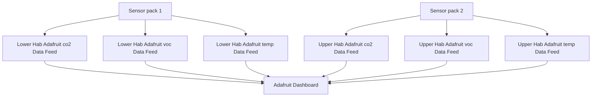
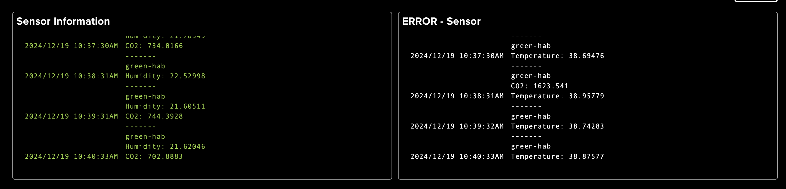
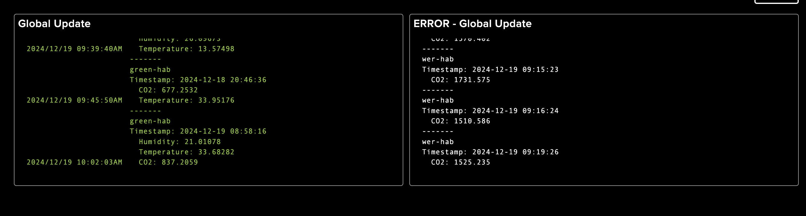
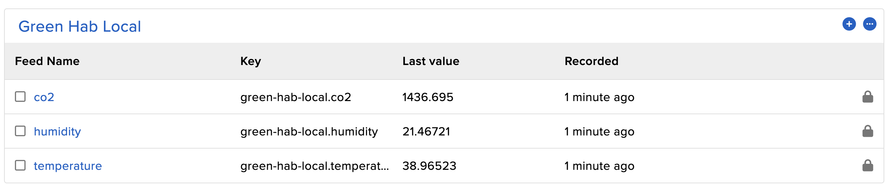
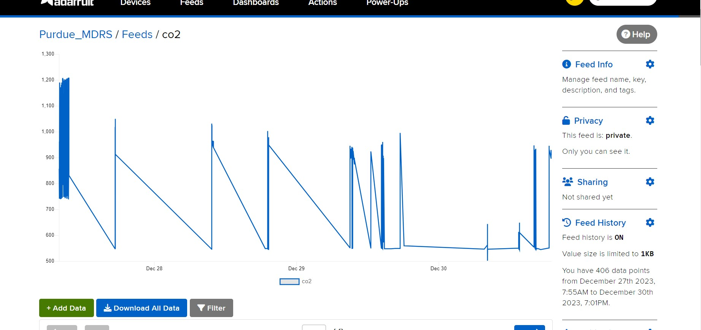

# MDRS_monitoring_overlay
Purdue MDRS raspberry pi hosted remote station monitoring system. This project is intended to use 10 rasperry pi pico w controllers spread throughout the MDRS campus to send information to an adafruit dashboard to display air quality data and airlock status, potentially being expanded to include EVA suit charge status, crew logs, and reports.

This repo contains both schematics and software.

This flowchart shows how the adafruit website organizes incoming data and displays it on the dashboard, for a few of the deployed sensors.

**While MDRS crews are on site sim should be maintained by respecting the ~22 minute lag time between mission control updates and pulling anything from the repo**

## Work so far
- Code available on this github allows for updating an adafruit dashboard from a raspberry pi pico w controller using the umqtt.simple mqtt library.

- Two air quality prototype modules have been constructed and tested at the MDRS station. At time of writing, they are being stored with MDRS staff at the Rock Shop near campus.

## Important Repo Files
 - adafruit_sensor_logging.py is what you'll be flashing onto the pico boards under then name "main.py." That is where we coordinate reading sensor data and sending it to the adafruit dashboard.
     - Note, this should be sending sensor data routinely, though in the schematics a button for manually logging data is included. The code to support this is currently commented out for other testing.
 - collectSensorData.py is similar to what's above, but stores the data locally to the pico board, rather than updating to the online dashboard. Made for testing sensor values without internet access.
 - adafruit_airlock_logging.py is an incomplete framework to flash to the pico boards that are monitoring airlock status around the MDRS facility. Should function exactly the same as adafruit_sensor_logging, but reed switches to monitor door status.
 - The sensorReading file contains several python files that set up and read data from the sensors for the proejct. Called by other programs above to streamline readability.

## TODO
- No airlock sensors have been constructed at MDRS, though the requisite parts should be present at the station. (reed switches and magnets) The code for these should function nearly identically to the air quality code however, and there is a nearly complete example in this repo.

- AA Batteries have been used to power pico w boards for sensor testing, and many are present at the station with our other reseaerch equipment, but it requires a pack of several to be used for an effective amount of time. After spending much time working with these battery packs, I'd recommend powering with micro usb cable to permanant wall fixture where possible, and rechargable battery packs when it's not.

- The two prototype air sensors do not have permanant casing solutions, one is mounted to a cardboard testing mount and the other has no mounting. A permanent and robust system is needed instead. The entire pi board and sensor system take up abot 1 square foot when laid out comfortably, the airlock system only requires the board and reed switches so it takes up much less room.

- Other features that could be implimented include water tank monitoring, EVA suit status, and adding crew logs / research updates into the dashboard. (TODO on whether or not the materials on the station can do this, or if more are needed)

## Air quality sensors
Reading from 5 air quality sensors (with datasheets)
 - temp / humidity (combined in one sensor) (currently not utilized in software due to problems with I2C connection, temporarily replaced with onboard temperature sensor)
   - http://aosong.com/userfiles/files/media/Data%20Sheet%20AHT21.pdfhttp://aosong.com/userfiles/files/media/Data%20Sheet%20AHT21.pdf 
 - CO2
   - https://cdn-reichelt.de/documents/datenblatt/C150/MH-Z19C-PC_DATENBLATT.pdf
 - PM2.5
   - https://wiki.keyestudio.com/Ks0196_keyestudio_PM2.5_Shield
 - VOC
   - https://www.winsen-sensor.com/d/files/zp07-mp503-10-grade-manual-air-quality-detection-module-1_3-terminal-forward.pdf
 - Ozone
   - https://cdn.sparkfun.com/assets/9/9/6/e/4/mq131-datasheet-low.pdf

## Project goals
10 raspberry pi pico w controllers throughout station measuring air quality, airlock status, and EVA suit status

5 controllers used for air quality monitoring, 1 in each of the MDRS buildings
 - RAM
 - Hab floor 1
 - Hab 2
 - Science Dome
 - Greenhab
   
5 controllers measuring airlock status using reed switches and magnets
 - One pi in each of the airlocks / doors on campus

Measuring EVA suit charge status using GPIO voltage detection
 - Not yet implimented, but suit charge is currently checked with with a multimeter before every EVA, so another pi pico w (or any other board that supports mqtt protocols and has an ADC)

## Setup Instructions

*Nothing fancy here, if you're already familiar*

Install Thonny [https://thonny.org]
 - Connects and flashes code to the raspberry pi boards very easily

Download pico firmware at [https://rpf.io/pico-w-firmware](https://rpf.io/pico-w-firmware)

Running Code from this repository (Instructions mainly from https://projects.raspberrypi.org/en/projects/get-started-pico-w/1)
  1. Clone git directory
  2. Connect pico to computer via micro usb
  3. Place firmware file into pico drive folder (You can literally just drag it)

     - pico folder in your file explorer should disappear
  
  4. Bottom right corner of Thonny shows what editor is being used, you should be able to select  ‘MicroPython (Raspberry Pi Pico)’ 
  5. Use save as in Thonny to save necessary code onto pico
    - keep in mind main.py always runs on pico boot

SecurityInfo
  - When you add your code to the pico make sure to also add securityInfo.py
  - securityInfo.py is ignored by git so you need a local copy that contains...

    ssid = "wifi name"  
    
    wifi_password = "wifi password"
    
    website_password = "website_password"
    
    mqtt_username
    
    mqtt_password

    mqtt_client_id
    
    all mqtt_topics

## Adafruit dashboard setup
adafruit_sensor_logging.py calls the read"X".py functions to read various sensor values based off the schematics above.

1) To use it copy all the read"X".py files onto the pico w then copt the main.py from dataPublishing folder.

2) Configure securityInfo.py (you can use the securityInfo_sample.py to get data)

3) Run it once connected to a machine where you can see terminal output to ensure it's working.
4) check adafruit dashboard to ensure auto logging and manual updates both work. (The feeds are created automatically, although you might need to create the dashboard to get data)
5) For Dashboard, stream based dashboard for good sensor channel and bad sensor channel are used.
6) When running code on the board the Raspberry pi Pico LEDs should blink on while connecting to internet, then flash every 5 seconds once setup is successful

#### Local Sensor Log Setup

CollectSensorData.py is a function that calls the read"X".py values in the repo above every hour and saves them into a timestamped csv file. This isn't needed for normal operation, but is instead available for debugging if needed.

  
Setup instructions
1. Save CollectSensorData.py onto the pico board
2. Rename it to main.py so that it runs on startup.
3. Copy the read"X".py files from the github, currently makes calls to following
    - readCO2.py
    - readTempHumid.py
4. To collect sensor data connect back to the pi via micro usb and download the csv files (should be a seperate file for each sensor)

## Online Dashboard
Sensor dashboard accessable at io.adafruit.com using Purdue MDRS credentials 

Dashboard is customizable to allow for text and buttons to be added (This cold be used to log off-nominal systems, research / EVA logs, and other crew logs that are be remotely accessible)

Here's a screenshot of our adafruit "local dashboard"

Here's a screenshot of our adafruit "global dashboard"

This is the main screen that displays the data collected from our sensors in a readable format. Right now as you can see there's only one chart there for testing, but using the settings dropdown on the right allows for formatting changes as wel as adding more data to the display once it's available.

This is from the other main page you'll be using on adafruit.

When you send data to the adafruit website you need to specify a topic in the code. (this is done in securityInfo in this case) This topic correlates to a feed, or stream of data on adafruit. 

Above you can see we have a seperate feed for co2, pm2.5, temp, and voc data. All of these sesnors are connected to one controlling board, but the data needs to be sent in seperate feeds so we know what everything corresponds to.

These can be manually organized into groups with custom names, as you can see we've named this Lower Hab monitoring. It's not necessary fpr functionality, but highly recommended to keep each data stream labelled and grouped.

Lastly, this is a screenshot of our co2 feed. Looking at any other sensor feed would look basically the same.

The main important thing here is that once you navigate here on the website you can download the data history as a csv using the download button.
